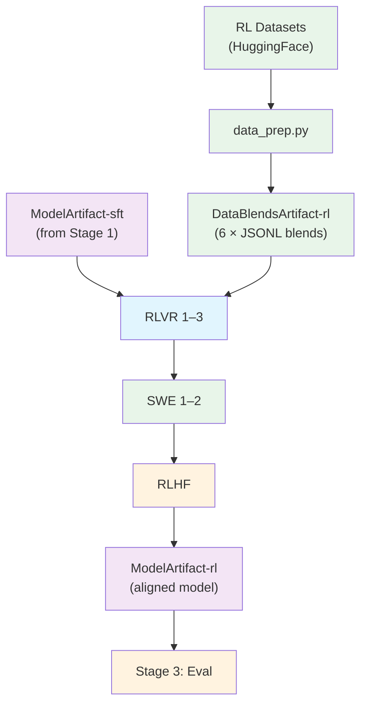

# Stage 2: Reinforcement Learning (RL)

Align the instruction-tuned model using GRPO (Group Relative Policy Optimization) with NeMo-RL.

## Overview

This stage takes the SFT model and further aligns it through a 6-sub-stage RL pipeline:

1. **RLVR 1–3** (stages 1.1–1.3) — Multi-environment RLVR with 21 reward environments
2. **SWE 1–2** (stages 2.1–2.2) — Software engineering RL with sandbox containers
3. **RLHF** (stage 3) — GenRM-based alignment with length penalty

Each sub-stage takes the output checkpoint of the previous one as input.

| Component | Description |
|-----------|-------------|
| `data_prep.py` | Downloads `nvidia/Nemotron-3-Super-RL-Training-Blends`, resolves HF placeholders, produces 6 blends |
| `train.py` | Runs GRPO training using NeMo-RL with Ray |
| `config/` | Per-stage configuration files |

## Quick Start

### Prerequisites

All RL stages require the base NeMo-RL container (`nemo-rl:v0.5.0.nemotron_3_super`).
SWE stages (2.1, 2.2) additionally require pre-fetched Python venvs — see
[SWE container build](#swe-container) below.

### Using nemotron CLI (Recommended)

```bash
# 1. Prepare data for each sub-stage
uv run nemotron super3 data prep rl rlvr --run YOUR-CLUSTER
uv run nemotron super3 data prep rl swe1 --run YOUR-CLUSTER
uv run nemotron super3 data prep rl swe2 --run YOUR-CLUSTER
uv run nemotron super3 data prep rl rlhf --run YOUR-CLUSTER

# 2. Run RL training stages sequentially
# Stage 1.1–1.3: RLVR (uses base container)
uv run nemotron super3 rl rlvr -c rlvr1 --run YOUR-CLUSTER
uv run nemotron super3 rl rlvr -c rlvr2 --run YOUR-CLUSTER
uv run nemotron super3 rl rlvr -c rlvr3 --run YOUR-CLUSTER

# Stage 2.1: SWE pivot (requires SWE container)
uv run nemotron super3 rl swe1 --run YOUR-CLUSTER

# Stage 2.2: SWE-bench (requires SWE container + Apptainer SIF images)
uv run nemotron super3 rl swe2 --run YOUR-CLUSTER

# Stage 3: RLHF (uses base container)
uv run nemotron super3 rl rlhf --run YOUR-CLUSTER

# Quick test (single GPU, validates RL infrastructure)
uv run nemotron super3 rl rlvr -c test --run YOUR-CLUSTER
```

> **`--run YOUR-CLUSTER`** refers to a profile defined in your `env.toml` file,
> which configures SLURM account, partition, mounts, and other cluster settings.
> See the [env.toml setup guide](../README.md#envtoml-setup) for details.

### Direct Script Execution

Inside a container on a compute node (requires NeMo-RL and Ray):

```bash
# Data preparation
python data_prep.py --config config/data_prep/default.yaml

# Training (Ray will be initialized internally)
python train.py --config config/stage1_rlvr.yaml \
    data.train.data_path=/path/to/rlvr1/train-split.jsonl \
    data.validation.data_path=/path/to/rlvr1/val-split.jsonl
```

## Data Preparation

The `data_prep.py` script downloads `nvidia/Nemotron-3-Super-RL-Training-Blends` from HuggingFace, resolves placeholder records, and produces 6 data blends.

### Placeholder Resolution

The source dataset contains placeholder records that reference external HF datasets (DAPO, Skywork). The data prep script:

1. Detects placeholder records by the presence of `_hf_placeholder` field
2. Fetches the actual data from the external HF dataset
3. Applies template restoration (DAPO prefix/suffix, Skywork `{question}` replacement)
4. Outputs 6 resolved blend directories with train/val splits

### Output

```
output/stage2_rl_resolved/
├── rlvr1/
│   ├── train-split.jsonl
│   └── val-split.jsonl
├── rlvr2/ ...
├── rlvr3/ ...
├── swe1/ ...
├── swe2/ ...
├── rlhf/ ...
└── manifest.json
```

The output is registered as a W&B Artifact (`DataBlendsArtifact-rl`) for lineage tracking.

## Training

### Configuration Files

| File | Purpose |
|------|---------|
| `config/stage1_rlvr.yaml` | RLVR stages 1.1–1.3 (109 nodes, 25 NeMo-Gym environments) |
| `config/stage2_swe1.yaml` | SWE stage 2.1 — SWE-pivot (64 nodes) |
| `config/stage2_swe2.yaml` | SWE stage 2.2 — SWE-bench with Apptainer (64 nodes) |
| `config/stage3_rlhf.yaml` | RLHF stage (72 nodes, GenRM reward) |
| `config/small_stage1_rlvr_21node.yaml` | Reduced RLVR (21 nodes) |
| `config/small_stage2_swe_pivot_8node.yaml` | Reduced SWE (8 nodes) |
| `config/small_stage3_rlhf_24node.yaml` | Reduced RLHF (24 nodes) |
| `config/default.yaml` | Base GRPO configuration |
| `config/tiny.yaml` | Testing variant (1 node, 10 steps) |

### Override Examples

```bash
# Fewer steps for testing
uv run nemotron super3 rl rlvr grpo.max_num_steps=100

# Different temperature
uv run nemotron super3 rl rlvr policy.generation.temperature=0.8

# Reduced-scale config
uv run nemotron super3 rl rlvr -c small --run YOUR-CLUSTER
```

## Artifact Lineage



## Requirements

- **NeMo-RL**: v0.5.0+ for GRPO training
- **Ray**: Automatically initialized for distributed execution
- **NeMo-Gym**: Provides reward environments
- **GPU nodes**: 109 nodes (RLVR), 64 nodes (SWE), 72 nodes (RLHF) — or use small configs
- **Sandbox container**: Required for SWE stages (code execution, Lean4 verification)
- **SWE container**: Required for SWE stages 2.1 and 2.2 (pre-fetched venvs)
- **Apptainer SIF images**: Required for SWE stage 2.2 (SWE-bench environments)

### SWE Container

SWE stages (2.1, 2.2) need pre-fetched Python virtual environments that are not
included in the base `nemo-rl:v0.5.0.nemotron_3_super` image. Build the SWE
container once (from within the [NeMo-RL](https://github.com/NVIDIA-NeMo/RL) repo):

```bash
docker buildx build \
  -t your-registry/nemo-rl:v0.5.0.nemotron_3_super_swe \
  --push \
  -f- . <<'EOF'
FROM nvcr.io/nvidia/nemo-rl:v0.5.0.nemotron_3_super

RUN <<'RUNEOF'
set -euxo pipefail
UV_TORCH_BACKEND=$(uv run python -c "import tomllib,pathlib; \
  indexes=tomllib.loads(pathlib.Path('pyproject.toml').read_text())['tool']['uv']['index']; \
  print(next(i['name'].removeprefix('pytorch-') for i in indexes if i['name'].startswith('pytorch-')))") \
UV_LINK_MODE=hardlink uv run python examples/nemo_gym/prefetch_venvs.py \
    examples/configs/super/stage2_swe1.yaml \
    examples/configs/super/stage2_swe2.yaml
RUNEOF
EOF
```

SWE2 additionally requires Apptainer `.sif` images — see
[stage2_swe2/README.md](stage2_swe2/README.md#prerequisites).

## Previous Stages

- [Stage 0: Pretraining](../stage0_pretrain/README.md) - Pretrain the base model
- [Stage 1: SFT](../stage1_sft/README.md) - Instruction tuning

## Next Steps

After RL completes, proceed to [Stage 3: Eval](../stage3_eval/README.md) for model evaluation.
