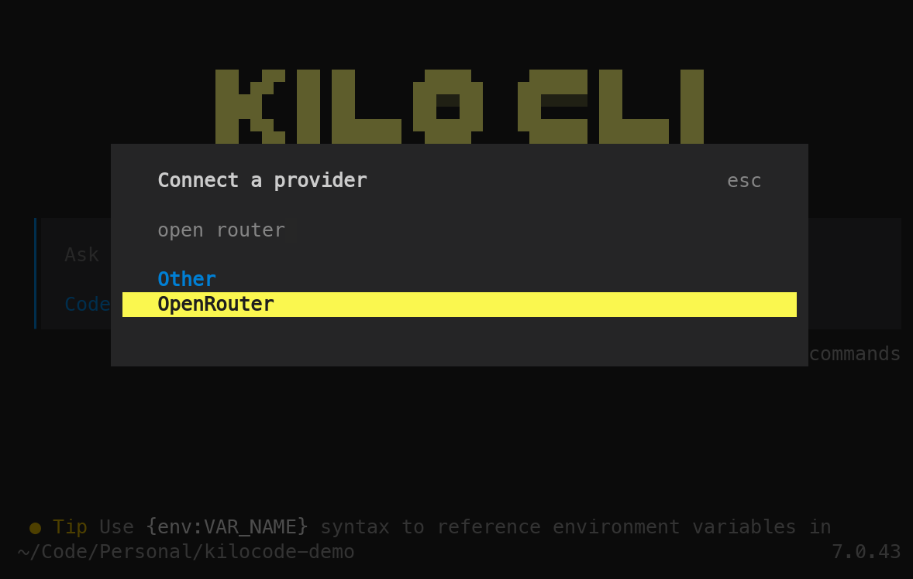
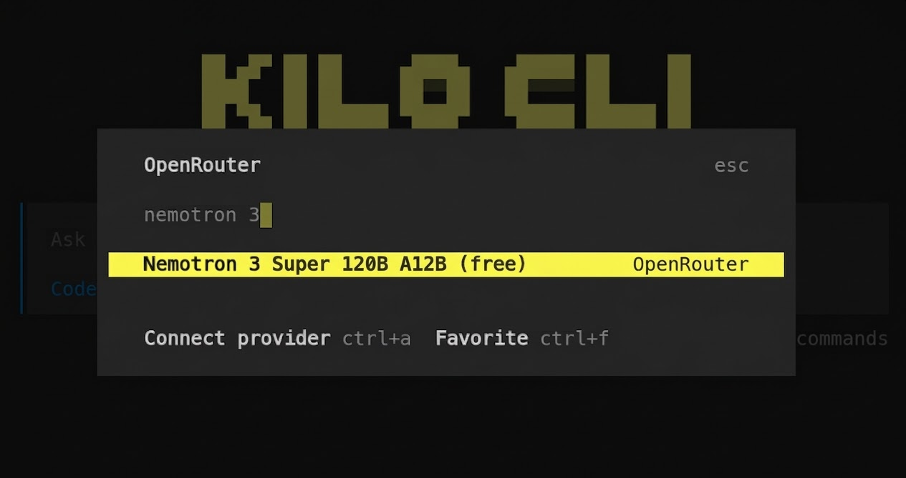
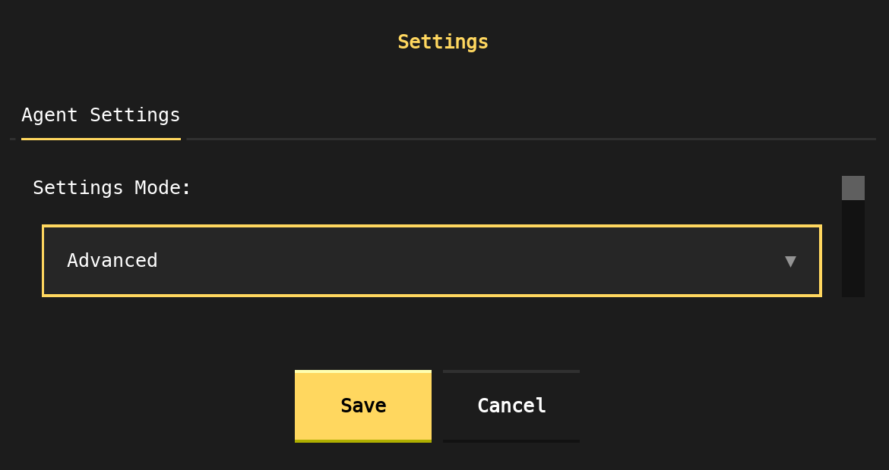
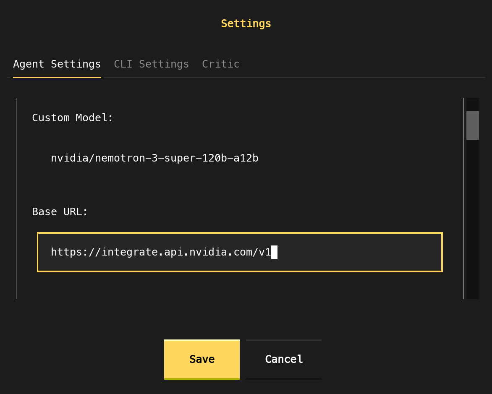
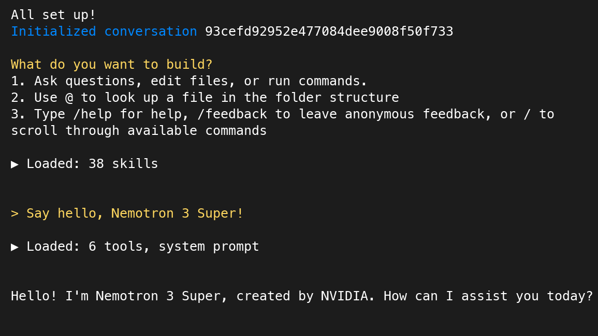

# Nemotron 3 Super with Agentic Coding Tools

Nemotron 3 Super is a 120B total / 12B active-parameter hybrid Mamba-Transformer MoE model built for agentic reasoning. This guide covers using it with **OpenCode**, **OpenClaw**, **Kilo Code CLI** and **OpenHands CLI** via OpenRouter and build.nvidia.com

## Why Nemotron 3 Super for Agentic Coding

The core bottleneck in agentic coding workflows is not raw benchmark accuracy — it is consistent, reliable behavior across many sequential steps. Two failure modes dominate: **goal drift** (the agent loses alignment with the original task as context accumulates) and **tool-call failures** (malformed or hallucinated function calls that break the execution loop).

Nemotron 3 Super addresses both directly:

**1M-token native context window.** Super's Mamba-2 backbone uses linear-time sequence processing, keeping the full working context live without forced truncation across long agentic sessions.

**Multi-token prediction (MTP) with shared-weight heads.** Built-in speculative decoding delivers 2–3x wall-clock speedup on structured generation like code and tool calls — no separate draft model required.

**Latent MoE.** Token compression before expert routing enables 4x as many specialists for the same inference cost, improving consistency across the mixed task types common in agentic sessions.

**Multi-environment RL alignment.** Post-trained across 15 environments in NeMo Gym covering multi-step tool use, code execution, and structured output — the same operations agentic tools run in their inner loops.

## Benchmark Performance

On [PinchBench](https://pinchbench.com/?score=best) - a new benchmark for determining how well LLM models perform as the brain of an OpenClaw agent - Nemotron 3 Super scores **85.6%** across the full test suite, making it the best open model in its class.

On SWE-Bench Verified we have the following scores while leveraging Nemotron 3 Super in the following Agent harnesses:

| Agent      | SWE-Bench Verified (%) |
|------------|------------------------|
| OpenHands  | 60.47%                 |
| OpenCode   | 59.20%                 |


## Setup

With the exception of OpenHands, all tools are configured to use Nemotron 3 Super via [OpenRouter](https://openrouter.ai) (`nvidia/nemotron-3-super-120b-a12b:free`). You will need an OpenRouter account and API key with access to that model before proceeding.

```bash
export OPENROUTER_API_KEY="sk-or-..."
```

### OpenCode

[OpenCode](https://opencode.ai) is an open-source terminal coding agent. Configure it via `~/.config/opencode/opencode.json`.

**Install**

```bash
npm install -g opencode-ai
```

**Configure**

```json
{
    "$schema": "https://opencode.ai/config.json",
    "model": "openrouter/nvidia-nemotron-3-super",
    "provider": {
        "openrouter": {
            "npm": "@ai-sdk/openai-compatible",
            "name": "OpenRouter",
            "options": {
                "baseURL": "https://openrouter.ai/api/v1",
                "apiKey": "{env:OPENROUTER_API_KEY}"
            },
            "models": {
                "nvidia-nemotron-3-super": {
                    "name": "nvidia/nemotron-3-super",
                    "limit": {
                        "context": 1000000,
                        "output": 32768
                    }
                }
            }
        }
    },
    "agent": {
        "build": {
            "temperature": 1.0,
            "top_p": 0.95,
            "max_tokens": 32000
        },
        "plan": {
            "temperature": 1.0,
            "top_p": 0.95,
            "max_tokens": 32000
        }
    }
}
```

**Run**

```bash
cd /path/to/project
opencode
/init   # first run: analyzes the project and creates AGENTS.md
```

### OpenClaw

[OpenClaw](https://docs.openclaw.ai) is a daemon-based autonomous agent that runs 24/7, connecting to WhatsApp, Telegram, Slack, Discord, and 50+ other services via a persistent heartbeat loop.

**Install**

Requires Node.js >= 22.

```bash
npm install -g openclaw@latest
openclaw onboard --install-daemon \
    --auth-choice apiKey \
    --token-provider openrouter \
    --token "$OPENROUTER_API_KEY"
```

`--install-daemon` registers OpenClaw as a background service that survives terminal sessions and reboots.

**Configure**

Edit `~/.openclaw/openclaw.json`. OpenClaw model refs use `openrouter/<provider>/<model>` format:

```json
{
    "agents": {
        "defaults": {
            "model": {
                "primary": "openrouter/nvidia/nemotron-3-super"
            }
        }
    }
}
```

**Verify and run**

```bash
openclaw doctor   # surfaces config issues
openclaw status   # confirms the gateway is running
openclaw tui      # launch the terminal UI
```

Once a messaging channel is paired (e.g. Telegram via `/connect`), the agent is reachable remotely without opening the TUI.

### Kilo Code CLI

The [Kilo Code CLI](https://kilo.ai/docs/code-with-ai/platforms/cli) uses the same underlying technology that powers the IDE extensions, so you can expect the same workflow to handle agentic coding tasks from start to finish.

**Install**

```bash
npm install -g @kilocode/cli
```

**Selecting Nemotron 3 Super Model**

First, we launch the Kilo Code tool:

```python
kilo
```

Next, type `/connect` and you can search for "OpenRouter".



After that - simply search for "Nemotron 3 Super".



You're now ready to get coding with Nemotron 3 Super!

### OpenHands

[OpenHands CLI](https://openhands.dev/product/cli) is a CLI tool that allows you to interact with the OpenHands AI Agent.

**Install**

```bash
uv tool install openhands --python 3.12
```

**Selecting Custom build.nvidia.com Model**

First, we launch the OpenHands tool:

```python
openhands
```

Next, type `/settings` to open the settings window and select "Advanced" from the dropdown. 



Then, you will enter the model and base URL as shown below: 

`nvidia/nemotron-3-super-120b-a12b` for Custom Model, and `https://integrate.api.nvidia.com/v1` for Base URL.



After that - click `Save`, restart your session, and you're good to get started!

